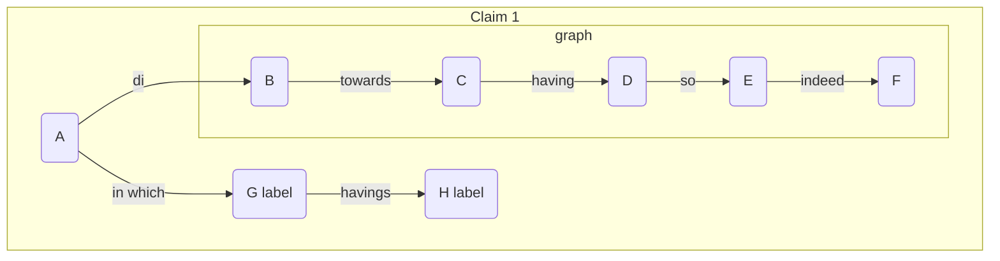

Sign Language Detection <!-- omit in toc -->
===
**Author:** *Azad Sadr* *Lorenzo Taroni* *Thomas Axel Deponte*  
**Date:** *6 july 2022*

&ensp;   

**Table of contents**  
- [titolo](#titolo)
  - [sottotitolo 1](#sottotitolo-1)
- [Conclusioni](#conclusioni)
- [References](#references)

&ensp;  

## titolo
***
### sottotitolo 1

  > *... in cui dette.* [[1]](#1) 
 
   [[2]](#2)

## Conclusioni
just some text...  

## References
<a id="1">[1]</a> 
ref. 
No.

<a id="2">[2]</a> 
Thomas A. Deponte, 1/12/2021. 
Analisi Rapporto ... 

<a id="3">[3]</a> 
Author. 
date.